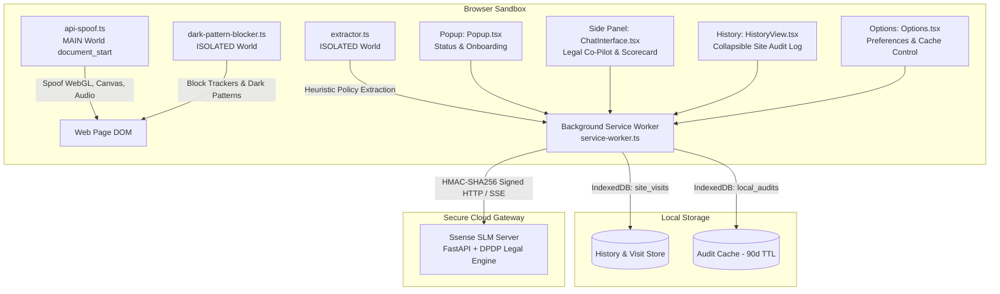

# 🧩 Ssense Chrome Extension (MV3)

> **Browser-side Privacy Shield & DPDP Act 2023 Compliance Co-Pilot**  
> Built on Manifest V3, React 18, and TypeScript. Pre-configured for zero-setup instant protection.

---

## 🚀 Overview

The **Ssense Chrome Extension** provides client-side privacy protection, deterministic statutory compliance auditing under India's **Digital Personal Data Protection (DPDP) Act 2023**, and an interactive legal co-pilot in the Chrome Side Panel.

### Key Capabilities
- 🛡️ **Active Protection**: Masks canvas, audio, and WebGL device fingerprinting in the `MAIN` execution world before tracking scripts execute.
- 📋 **Automated DPDP Auditing**: Heuristically extracts the active site's privacy policy, securely evaluates it via an SLM (Small Language Model) legal engine, and generates a structured compliance scorecard with statutory references.
- 💬 **Interactive Legal Co-Pilot**: Conversational sidepanel assistant that answers questions about any site's data practices, retention policies, and cross-border transfers. Supports both rapid concise mode and deep chain-of-thought legal reasoning.
- 🕘 **Collapsible Compliance History**: Per-site compliance log with violation breakdowns, evidence quotes, sparkline score history, and CSV export.
- 🌓 **Browser Theme Synchronization**: Seamlessly adapts to your browser's dark or light theme via `prefers-color-scheme`.

---

## 🏛️ Architecture Overview



### Core Subsystems

1. **MAIN World Preemptive Spoofer (`src/content/api-spoof.ts`)**:
   - Injected at `document_start` into the `MAIN` execution world.
   - Masks device fingerprints before tracking scripts execute:
     - WebGL vendor/renderer spoofing (reports standard hardware profiles).
     - Canvas noise injection to defeat pixel-level hash extraction.
     - AudioContext buffer quantization.
     - `navigator.hardwareConcurrency` and battery API shielding.
   - Employs prototype proxy wrapping disguised as `[native code]` to defeat anti-tamper libraries like FingerprintJS.

2. **Policy Extractor (`src/content/extractor.ts`)**:
   - Discovers privacy policies via DOM heuristic scanning, link pattern matching, and fallback discovery.
   - Cleans HTML boilerplate, scripts, and stylesheets, extracting raw text with statutory structure.
   - Truncates policies to 16,000 characters to prevent context window overflow while preserving critical consent and data collection clauses.

3. **Active DOM Enforcer (`src/content/dark-pattern-blocker.ts`)**:
   - Actively removes (`el.remove()`) offending third-party tracking scripts, iframes, and beacons identified by the audit engine.
   - Applies visual suppression to dark-pattern banners.
   - Defeats click-jacking, pre-ticked consent checkboxes, and forced account creation dialogs.

4. **Background Service Worker & API Client (`src/background/`)**:
   - `service-worker.ts`: Central message router and state coordinator.
   - `api-client.ts`: Handles cryptographic HMAC-SHA256 challenge-response signing for all requests to the SLM server, with automatic reconnection and SSE stream parsing.
   - `audit-cache.ts`: IndexedDB persistence with 90-day validity tracking.
   - `history-store.ts`: Tracks visit frequency, cumulative active duration, and score trends over time.

5. **UI Layer (`src/sidebar/`, `src/popup/`, `src/options/`)**:
   - Built with React 18 and vanilla CSS design system tokens.
   - **Popup**: Fast device registration, server status indicator with pulsing shield, and side panel launcher.
   - **Side Panel**: Live legal co-pilot, rich markdown parsing (headers, lists, quotes), DPDP trust score breakdown, and active protection controls.
   - **History**: Collapsible accordion cards showing global legal reasoning, individual violation types, statutory references, evidence quotes, and CSV export.
   - **Options**: Zero-config default with optional self-hosted server override, cache purge, and release telemetry.

---

## 📦 Directory Structure

```text
apps/extension/
├── public/                     # Static extension assets and icons
│   ├── manifest.json           # Chrome Extension Manifest V3 definition
│   └── icons/                  # 16px, 48px, 128px extension icons
├── src/
│   ├── background/             # Chrome MV3 service worker & networking
│   │   ├── service-worker.ts   # Central message bus & tab event handler
│   │   ├── api-client.ts       # HMAC-SHA256 authenticated REST/SSE client
│   │   ├── audit-cache.ts      # IndexedDB audit result cache (90-day TTL)
│   │   └── history-store.ts    # IndexedDB site visit history & score tracking
│   ├── content/                # Injected webpage scripts
│   │   ├── api-spoof.ts        # MAIN-world anti-fingerprinting spoofer
│   │   ├── extractor.ts        # Privacy policy DOM parser & cleaner
│   │   ├── dark-pattern-blocker.ts # Active tracker remover & DOM sanitizer
│   │   └── chat-widget.ts      # Floating on-page co-pilot button
│   ├── sidebar/                # Chrome Side Panel UI (React 18)
│   │   ├── App.tsx             # Root side panel view router
│   │   └── components/
│   │       ├── ChatInterface.tsx # Legal Co-Pilot, Design System CSS & streaming chat
│   │       ├── HistoryView.tsx   # Collapsible audit history & CSV export
│   │       └── PrivacyView.tsx   # Detailed structured audit report view
│   ├── popup/                  # Extension toolbar popup
│   │   └── Popup.tsx           # Setup handshake, status, and side panel launcher
│   ├── options/                # Extension settings page
│   │   └── Options.tsx         # Account status, privacy controls, custom server override
│   ├── types/                  # TypeScript data contracts
│   │   └── server-protocol.ts  # AuditReport, Violation, and API types
│   └── utils/
│       └── domain.ts           # Domain normalization and host matching
├── package.json                # Project dependencies and build scripts
├── tsconfig.json               # TypeScript compiler options
└── vite.config.ts              # Vite multi-page extension build pipeline
```

---

## 🛠️ Building & Developing

### Prerequisites
- **Node.js**: v18.0.0 or later (v20+ recommended)
- **npm**: v9.0.0 or later

### Installation
From the `apps/extension` directory:

```bash
cd apps/extension
npm install
```

### Production Build
Compile TypeScript and bundle assets with Vite:

```bash
npm run build
```

The compiled extension is output to `apps/extension/dist/`.

### Development Watch Mode
To run Vite in watch mode during development:

```bash
npm run dev
```

---

## 🌐 Loading in Google Chrome

1. Open Google Chrome and navigate to `chrome://extensions/`.
2. Enable **Developer mode** using the toggle in the top-right corner.
3. Click the **Load unpacked** button in the top-left toolbar.
4. Select the directory: `<path-to-repo>/apps/extension/dist`.
5. Pin Ssense to your Chrome toolbar for quick access.

---

## ⚙️ Extension Settings & Configuration

Click the extension icon and select **Settings**, or open `chrome://extensions/?options=<EXTENSION_ID>`:

| Section | Setting | Default | Description |
| :--- | :--- | :--- | :--- |
| **Status** | Connection | Automatic | Checks link to Ssense SLM Server. |
| **Account** | 1-Click Handshake | One-time | Generates device-specific HMAC keys and activates hourly AI quota. |
| **Privacy** | Local Cache & History | Active | Stores compliance reports locally. Click "Clear Data" to purge. |
| **Advanced** | Custom Server Override | Disabled | Option to point the extension to a private self-hosted SLM server. |
| **About** | Version & Protocol | v1.0.0 | Manifest V3 specification, DPDP legal engine details. |

---

## 🔒 Privacy & Data Minimization Statement

Ssense is engineered with a strict **zero data harvesting** policy:

1. **No Browsing History Sent**: Your browsing history, visited URLs, search queries, and page contents are processed exclusively inside your local browser.
2. **Policy Text Only**: Only the public text of the website's privacy policy (or its public URL) is transmitted to the audit model to evaluate compliance.
3. **No Account Required**: The extension works out of the box. Optional Google identity detection is used purely for local device identification and rate-limit quotas.
4. **Local Audit Cache**: Audits are stored in your browser's private IndexedDB for 90 days and never uploaded to any centralized profile.

---

## 🔍 Debugging & Logs

- **Service Worker Logs**: Go to `chrome://extensions/` → click the **service worker** link under Ssense.
- **Side Panel Logs**: Right-click anywhere in the Side Panel and select **Inspect**.
- **Popup Logs**: Right-click the extension toolbar icon, open popup, right-click inside and select **Inspect**.
- **Content Script Logs**: Open Chrome DevTools (`F12`) on any audited webpage and filter Console by `[Ssense]`.
