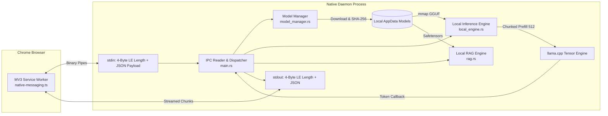

# ⚡ Ssense Native Daemon (`ssense-native-daemon`)

> **Bare-Metal Rust Edge AI Inference Engine & Chrome Native Messaging Host.**

The Ssense Native Daemon is a high-performance, crash-resilient background process that runs on the user's local operating system. It communicates with the Ssense Chrome Extension via Google Chrome's standard **Native Messaging Protocol**, enabling zero-knowledge, zero-latency local LLM inference without sending sensitive privacy policy text to third-party cloud servers.

---

## 🏛️ Core Architecture



### Key Engineering Features

1. **4-Byte Little-Endian Binary IPC Framing**:
   - Implements Google Chrome's Native Messaging specification: each message is preceded by a 32-bit unsigned integer in little-endian format specifying the payload length in bytes, followed by valid UTF-8 JSON.
   - Decoupled asynchronous `writer_task` ensures write operations to Chrome never block tensor calculations or I/O loops.

2. **Resilient Model Manager (`src/model_manager.rs`)**:
   - **Hugging Face Tree API**: Queries `https://huggingface.co/api/models/{repo}/tree/main?recursive=true` to fetch authoritative byte sizes and Git LFS `oid` SHA-256 checksums in a single round-trip.
   - **Download Guard & Process Liveness**: An `Arc<AtomicBool>` tracking flag prevents the daemon from shutting down when Chrome closes or reloads tabs while a download is writing to disk.
   - **Streaming Verification**: Streams `DOWNLOAD_PROGRESS` events every 500ms during SHA-256 calculation of 4.68GB GGUF models. This feeds live visual status to the user and keeps Chrome MV3 service workers alive.
   - **Resumable HTTP Ranges**: Preserves `.part` files on disk across transient network drops or user pauses, resuming via `Range: bytes=X-` requests.

3. **Optimized Local Engine (`src/inference/local_engine.rs`)**:
   - **Chunked Prefill Batching**: Splits long input contexts into 512-token chunks (`BATCH_CAPACITY = 512`), iteratively decoding without calculating logits until the terminal token. This completely eliminates GGML assertion aborts and VRAM allocation spikes.
   - **Real-Time Token Streaming**: Provides `chat_with_context_stream` with a per-token callback, allowing instant interactive chat responses in the Chrome sidebar UI.
   - **Deterministic GBNF Grammar**: Constrains the sampler with GPT-BNF grammar rules derived from `dpdp_schema.json`, mathematically ensuring the LLM output is 100% valid JSON matching the schema.

4. **Hardware Profiler (`src/inference/hardware_profiler.rs`)**:
   - Detects CPU thread topology, AVX2, AVX512, and GPU acceleration capabilities.
   - Gracefully degrades gracefully with diagnostic telemetry if hardware limits are constrained.

---

## 📂 Directory Layout

```text
apps/native-daemon/
├── src/
│   ├── main.rs                   # IPC event loop and Tokio channel dispatcher
│   ├── model_manager.rs          # Download manager, SHA-256 verification, and file tracking
│   ├── cache/
│   │   └── mod.rs                # SQLite WAL persistent inference cache
│   ├── inference/
│   │   ├── local_engine.rs       # llama.cpp engine, chunked prefill, token streaming
│   │   ├── hardware_profiler.rs  # System CPU/VRAM capability probe
│   │   └── grammar.rs            # GBNF grammar constraints for JSON compliance
│   ├── messaging/
│   │   └── protocol.rs           # DaemonRequest and DaemonResponse serde definitions
│   └── rag/
│       └── mod.rs                # Fast safetensors embedding and lexical search
├── Cargo.toml                    # Rust crate dependencies and features
└── com.ssense.native_daemon.json # Chrome Native Messaging manifest template
```

---

## 🔨 Building the Native Daemon

### Prerequisites

- **Rust**: Stable toolchain (1.75+ recommended)
- **C/C++ Compiler**:
  - **Windows**: MSYS2 UCRT64 (`gcc`, `clang`, `cmake`, `ninja`) or MSVC Build Tools.
  - **Linux**: `build-essential`, `cmake`, `clang`, `libclang-dev`.
  - **macOS**: Xcode Command Line Tools, `cmake`.

### Windows Setup (MSYS2 UCRT64)

Ensure MSYS2 UCRT64 binaries and `libclang.dll` are in your path:

```powershell
$env:LIBCLANG_PATH = "C:\msys64\ucrt64\bin"
$env:PATH = "C:\msys64\ucrt64\bin;" + $env:PATH
```

### Compilation

From the workspace root or `apps/native-daemon` directory:

```bash
# Debug build (for rapid iteration)
cargo build -p ssense-native-daemon

# Release build (optimized tensor performance)
cargo build --release -p ssense-native-daemon
```

The executable is generated at:
- `target/release/ssense-native-daemon.exe` (Windows)
- `target/release/ssense-native-daemon` (Linux/macOS)

---

## 🔗 Chrome Native Host Registration

Google Chrome requires a Native Messaging manifest JSON registered in the host operating system so it knows which binary to execute when an extension calls `chrome.runtime.connectNative("com.ssense.native_daemon")`.

### Automated Registration Script

From the workspace root, run the registration script using Node.js:

```bash
node scripts/register-nmh.js
```

**What the script does:**
1. Detects your built `ssense-native-daemon` binary in `target/release/` or `target/debug/`.
2. Generates the manifest file `com.ssense.native_daemon.json` containing the exact absolute path to the binary.
3. Automatically writes the registry key on Windows:
   `HKCU\Software\Google\Chrome\NativeMessagingHosts\com.ssense.native_daemon`
   pointing to the manifest JSON.
   (On Linux, writes to `~/.config/google-chrome/NativeMessagingHosts/com.ssense.native_daemon.json`).

---

## 🧪 Testing Standalone IPC via CLI

You can simulate Chrome's Native Messaging IPC from PowerShell or Bash to test the daemon directly without opening a browser.

### Test Ping via PowerShell:

```powershell
# Length-prefixed ping message
$json = '{"type":"PING"}'
$bytes = [System.Text.Encoding]::UTF8.GetBytes($json)
$len = [System.BitConverter]::GetBytes([uint32]$bytes.Length)

$stream = [System.IO.MemoryStream]::new()
$stream.Write($len, 0, 4)
$stream.Write($bytes, 0, $bytes.Length)
$stream.Position = 0

$proc = Start-Process -FilePath "target\debug\ssense-native-daemon.exe" -NoNewWindow -RedirectStandardInput $stream -PassThru
```

---

## 🩺 Diagnostic Logs & Troubleshooting

- **Log File Location**: On Windows, logs are written to stdout or to `%LOCALAPPDATA%\Ssense\logs\`.
- **Premature Exit**: If the daemon exits immediately, ensure the Native Host registry key points to the correct manifest path and that `com.ssense.native_daemon.json` has the correct extension ID under `allowed_origins`.
- **Model Storage**: GGUF weights are stored under `%LOCALAPPDATA%\Ssense\models\`. If downloads fail, verify available disk space.
