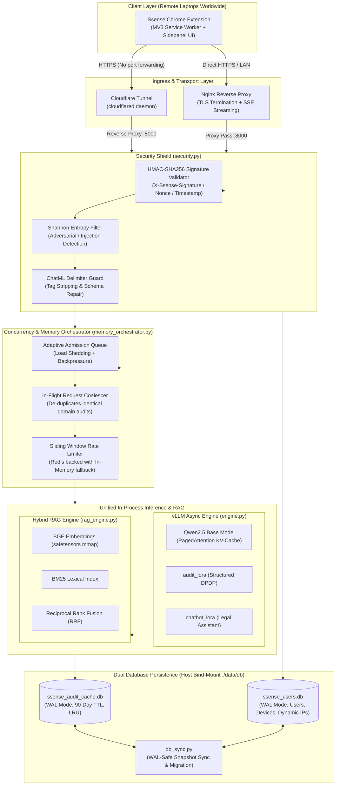
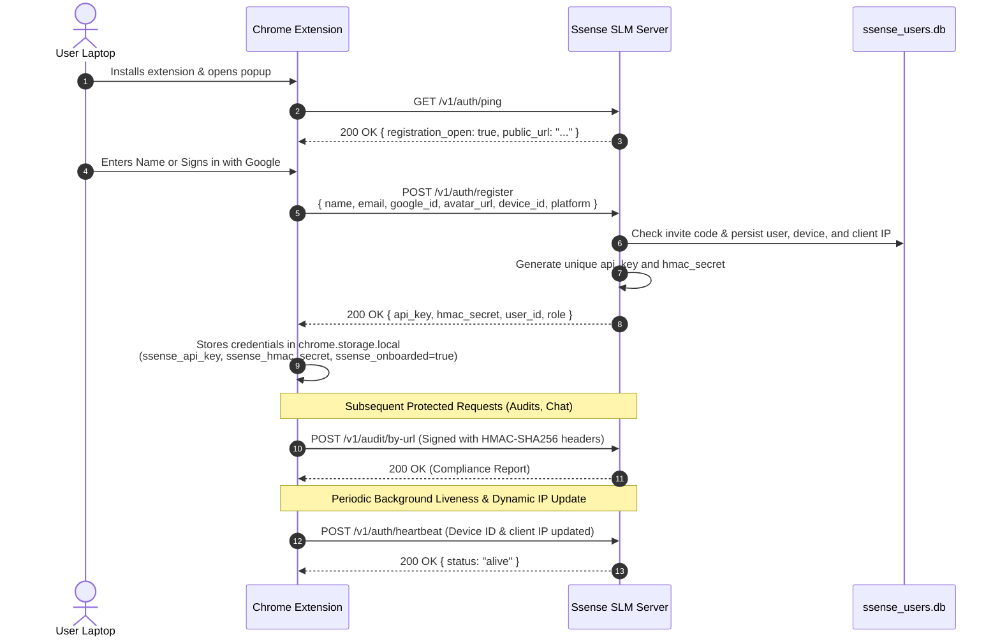

# Ssense SLM Server — Architecture & Deployment Guide

> **Enterprise-Grade, On-Premise Small Language Model (SLM) Server for DPDP Act 2023 Compliance Auditing & Privacy Copilot**

The **Ssense SLM Server** provides private, local compliance intelligence. It executes the legal evaluation pipeline for the **Ssense Chrome Extension**, performing automated privacy policy compliance audits against the Indian **Digital Personal Data Protection (DPDP) Act 2023**, generating structured violation reports, and powering real-time RAG-augmented legal chat — **100% on your own infrastructure with zero external API dependencies or data leakage**.

---

## Table of Contents

1. [System Architecture](#system-architecture)
   - [Architectural Principles](#architectural-principles)
   - [End-to-End System Topology](#end-to-end-system-topology)
   - [Core Subsystem Breakdown](#core-subsystem-breakdown)
2. [Project Layout](#project-layout)
3. [Hardware Profiles & Requirements](#hardware-profiles--requirements)
4. [Step-by-Step Setup Walkthrough](#step-by-step-setup-walkthrough)
   - [Step 1: Host Prerequisites](#step-1-host-prerequisites)
   - [Step 2: Environment Configuration](#step-2-environment-configuration)
   - [Step 3: Launching the Server](#step-3-launching-the-server)
   - [Step 4: Health Check & Telemetry Verification](#step-4-health-check--telemetry-verification)
5. [Worldwide Global Accessibility (No Domain Needed)](#worldwide-global-accessibility-no-domain-needed)
   - [Workflow A: Quick Zero-Config Tunnel (Recommended)](#workflow-a-quick-zero-config-tunnel-recommended)
   - [Workflow B: Named Cloudflare Zero Trust Tunnel](#workflow-b-named-cloudflare-zero-trust-tunnel)
   - [Workflow C: Direct Nginx TLS / LAN Access](#workflow-c-direct-nginx-tls--lan-access)
6. [Extension Handshake & Client Registration](#extension-handshake--client-registration)
7. [API Reference](#api-reference)
   - [Public Endpoints](#public-endpoints)
   - [Authenticated Endpoints (HMAC-SHA256)](#authenticated-endpoints-hmac-sha256)
   - [Admin Endpoints](#admin-endpoints)
8. [Database Schema & Persistence](#database-schema--persistence)
   - [Dual Database Architecture](#dual-database-architecture)
   - [Live Backups & Zero-Downtime Migration](#live-backups--zero-downtime-migration)
   - [Multi-Instance Synchronization](#multi-instance-synchronization)
9. [Environment Variables Reference](#environment-variables-reference)
10. [Verification & Testing Suite](#verification--testing-suite)
11. [NVIDIA Jetson AGX Spark Optimization Guide](#nvidia-jetson-agx-spark-optimization-guide)
12. [Production Deployment Checklist & Operations](#production-deployment-checklist--operations)

---

## System Architecture

### Architectural Principles

The server is engineered around five fundamental design invariants:

1. **Zero-Hop In-Process Inference**: FastAPI and the vLLM engine run in a single unified process. By avoiding gRPC, IPC sockets, or HTTP hops between the web server and inference engine, Time-To-First-Token (TTFT) is minimized.
2. **Multi-LoRA Dynamic Multiplexing**: A single base model (`Qwen2.5-Coder-7B-Instruct`) simultaneously serves two low-rank adapters (`audit_lora` for structured DPDP extraction and `chatbot_lora` for conversational legal guidance) with zero memory swapping overhead.
3. **Hybrid RAG (Dense BGE + Sparse BM25 + RRF)**: Combines exact lexical matching (for statutory section numbers, legal clauses, and statutory citations) with dense vector semantic search (for conceptual privacy violations and paraphrased policies). Merged via Reciprocal Rank Fusion.
4. **Adaptive Admission & Coalescing**: Prevents out-of-memory (OOM) crashes under heavy load through an adaptive queue. Duplicate in-flight audit requests for the same domain are automatically coalesced, running inference once and broadcasting results across all waiting clients.
5. **Zero-Trust Cryptographic Shield**: Every request is authenticated using HMAC-SHA256 signatures, sliding-window timestamps, nonce replay checks, Shannon entropy prompt-injection filters, and ChatML delimiter sanitization.

### End-to-End System Topology



### Core Subsystem Breakdown

| Subsystem | Source File | Core Responsibilities |
|---|---|---|
| **API & Lifespan** | `main.py` | FastAPI application, lifecycle hooks, SSE streaming endpoints, admin tools, Prometheus metrics. |
| **Inference Engine** | `engine.py` | vLLM `AsyncLLMEngine` initialization, Multi-LoRA multiplexing, per-profile KV-cache tuning, prompt caching. |
| **Security Shield** | `security.py` | HMAC-SHA256 signature verification, replay protection (timestamp + nonce), Shannon entropy scanner, ChatML sanitization, JSON schema auto-repair. |
| **Memory Orchestrator** | `memory_orchestrator.py` | Admission queue with backpressure, concurrency throttling, in-flight request coalescing, task lifecycle management. |
| **Hybrid RAG** | `rag_engine.py` | DPDP Act 2023 section retrieval, in-memory BM25 lexical search + dense BGE vector search (`safetensors` zero-copy mmap), reciprocal rank fusion. |
| **Audit Cache Store** | `audit_store.py` | SQLite audit result cache, 90-day TTL, SHA-256 policy text hashing, in-memory LRU fast path, WAL journaling. |
| **User & Device Registry** | `user_store.py` | User onboarding, Google account linking, API key & HMAC secret provisioning, device registration, dynamic IP roaming history. |
| **Database Sync** | `db_sync.py` | Safe WAL vacuum snapshot generation, automatic startup import for fresh instances, zero-downtime backups. |
| **Policy Ingestion** | `policy_fetcher.py` | Async streaming HTTP fetcher, HTML boiler-plate stripping, main-content extraction, privacy policy text normalization. |
| **Session Manager** | `multi_user_session.py` | Multi-turn conversational context buffers, per-user session isolation, LRU eviction. |
| **Distributed Limiter** | `redis_limiter.py` | Redis-backed sliding-window rate limiting with automatic, seamless fallback to in-memory tracking. |

---

## Project Layout

```
apps/slm-server/
|-- main.py                     # FastAPI application entry point, lifespan, all REST/SSE endpoints
|-- engine.py                   # In-process vLLM async engine, Multi-LoRA manager, KV-cache tuning
|-- security.py                 # HMAC verification, Shannon entropy filter, schema auto-repair
|-- rag_engine.py               # Hybrid RAG engine (BM25 + BGE safetensors mmap + RRF)
|-- memory_orchestrator.py      # Admission queue, in-flight request coalescer, concurrency manager
|-- audit_store.py              # SQLite audit cache (WAL mode, 90-day TTL, LRU hot cache)
|-- user_store.py               # SQLite user/device registry, credential provisioning, IP tracker
|-- db_sync.py                  # WAL-safe DB snapshot export/import for multi-instance sync
|-- policy_fetcher.py           # Async privacy policy HTML fetcher and clean text extractor
|-- multi_user_session.py       # Per-user conversational multi-turn chat session memory
|-- redis_limiter.py            # Redis distributed rate limiter with automatic in-process fallback
|-- sitecustomize.py            # Runtime bootstrapping (UTF-8 encoding, platform workarounds)
|
|-- Dockerfile.gpu              # Discrete NVIDIA CUDA base + vLLM (Datacenter / Workstation)
|-- Dockerfile.jetson           # NVIDIA L4T base + vLLM for Jetson AGX Spark / Orin (JetPack 6)
|-- Dockerfile.cpu              # Python slim base + vLLM CPU backend with OpenMP / AVX-512
|-- docker-compose.yml          # Multi-profile orchestration (gpu, jetson, cpu, tunnel, redis)
|-- docker-entrypoint.sh        # Container init: ownership validation, profile detection, gosu drop
|-- .env.example                # Comprehensive template of all configuration variables
|
|-- nginx/
|   |-- nginx.gpu.conf          # Nginx configuration tuned for GPU profile (high worker limits)
|   |-- nginx.jetson.conf       # Nginx configuration tuned for Jetson AGX unified memory
|   |-- nginx.cpu.conf          # Nginx configuration tuned for CPU thread allocation
|   |-- certs/                  # SSL certificate mount directory (ssense.crt, ssense.key)
|
|-- scripts/
|   |-- deploy.sh               # Bash deployment script with hardware auto-detection (Linux/macOS)
|   |-- deploy.ps1              # PowerShell deployment script for Windows environments
|   |-- run.sh                  # Lifecycle management & automated cryptographic key generator
|   |-- start_lab_tunnel.py     # Zero-config Cloudflare Quick Tunnel & auto .env synchronizer
|   |-- backup_db.sh            # Live non-disruptive WAL-safe database backup utility
|   |-- migrate_db.sh           # Cross-host database migration utility via rsync
|   |-- install_torch.sh        # Platform-specific PyTorch / CUDA wheel installer helper
|   |-- test_e2e_audit.py       # End-to-end audit smoke test client
|   |-- batch_test.py           # Concurrent multi-site compliance evaluation harness
|
|-- schemas/
|   |-- dpdp_schema.json        # Official DPDP Act 2023 JSON Schema for audit validation
|   |-- dpdp_act_tree.json      # Structured hierarchical section tree for RAG indexing
|
|-- data/
|   |-- db/                     # Host bind-mount directory for SQLite databases
|       |-- ssense_audit_cache.db
|       |-- ssense_users.db
|
|-- tests/
|   |-- test_server_security.py # Unit tests for HMAC, replay window, entropy, schema repair
|   |-- test_user_store_and_auth.py # Unit tests for UserStore, registration, handshake, dynamic IP
|   |-- test_clean_report.py    # Unit tests for audit report cleansing & validation
```

---

## Hardware Profiles & Requirements

The server includes three distinct, production-ready profiles. All profiles run the **same** application code and base models; only the container runtime, base images, and memory parameters differ:

| Profile | Target Hardware | Base Image | GPU Passthrough | Default Concurrency |
|---|---|---|---|---|
| **`jetson`** | NVIDIA Jetson AGX Spark / Orin / Xavier (JetPack 6, L4T r36.x) | `nvcr.io/nvidia/l4t-jetpack:r36.4.0` | `runtime: nvidia` (Unified Memory) | 14 inference slots, 500 queue depth |
| **`gpu`** | Discrete NVIDIA GPUs (RTX 3090/4090, A100, H100, L40S) | `vllm/vllm-openai:latest` | `deploy.resources.reservations` | 220 inference slots, 20,000 queue depth |
| **`cpu`** | Intel Xeon, AMD EPYC, Modern x86_64 CPUs with AVX-512 | `python:3.11-slim` | None (OpenMP threading) | 7 inference slots, 300 queue depth |

### Hardware Minimums & Recommendations

* **NVIDIA Jetson AGX Spark / Orin (Recommended On-Premise Host)**:
  * Minimum: 32 GB 128-bit LPDDR5 unified memory.
  * Recommended: 64 GB unified memory.
  * Storage: NVMe SSD with at least 50 GB free space for base weights and cache.
* **Discrete NVIDIA GPU Server**:
  * Minimum: 16 GB VRAM (RTX 4080 / RTX 3090) with AWQ/GPTQ or FP8 quantization.
  * Recommended: 24 GB+ VRAM (RTX 3090/4090, A5000, A100).
  * Host RAM: 32 GB minimum (allows swap space buffer).
* **CPU-Only Server**:
  * Minimum: 8 physical x86_64 cores with AVX-512 support, 32 GB DDR4/DDR5 RAM.
  * Recommended: 16+ cores (Intel Sapphire Rapids or AMD EPYC 9004), 64 GB RAM.

---

## Step-by-Step Setup Walkthrough

### Step 1: Host Prerequisites

Ensure your host machine has Docker 24.0+ and the Docker Compose v2 plugin installed.

* **On Linux / AGX Spark**:
  ```bash
  docker --version
  docker compose version
  ```
  For NVIDIA GPUs / Jetson, verify the NVIDIA Container Runtime:
  ```bash
  # For discrete GPUs:
  nvidia-smi
  docker run --rm --gpus all nvidia/cuda:12.2.0-base-ubuntu22.04 nvidia-smi

  # For Jetson (AGX Spark):
  cat /etc/nv_tegra_release
  docker run --rm --runtime nvidia nvcr.io/nvidia/l4t-base:r36.2.0 nvidia-smi
  ```

### Step 2: Environment Configuration

Navigate to the `apps/slm-server` directory:

```bash
cd apps/slm-server
```

You can automatically generate a secure `.env` file with freshly minted cryptographic secrets by running:

```bash
chmod +x scripts/run.sh
./scripts/run.sh
```

Alternatively, copy `.env.example` manually:

```bash
cp .env.example .env
```

Generate two high-entropy cryptographic keys and paste them into `.env`:

```bash
# Generate SSENSE_API_KEYS (32-byte urlsafe secret)
python3 -c "import secrets; print(secrets.token_urlsafe(32))"

# Generate SSENSE_HMAC_SECRET (48-byte urlsafe secret)
python3 -c "import secrets; print(secrets.token_urlsafe(48))"
```

Configure your initial `.env` variables:
```ini
SSENSE_ENV=production
SSENSE_API_KEYS=your_generated_api_key_here
SSENSE_HMAC_SECRET=your_generated_hmac_secret_here
SSENSE_ALLOWED_ORIGINS=*
SSENSE_ALLOW_REGISTRATION=true
```

> **Security Note**: Never commit `.env` to git. In production, restrict `SSENSE_ALLOWED_ORIGINS` to your extension's Chrome Extension ID (`chrome-extension://<id>`).

### Step 3: Launching the Server

#### Method A: Automated Detection (Recommended)

The deployment script automatically detects whether your system is a Jetson AGX, a discrete GPU host, or a CPU-only machine, and starts the appropriate profile:

* **On Linux / Jetson / macOS**:
  ```bash
  chmod +x scripts/deploy.sh
  ./scripts/deploy.sh
  ```
* **On Windows (PowerShell)**:
  ```powershell
  Set-ExecutionPolicy -Scope Process -ExecutionPolicy Bypass
  .\scripts\deploy.ps1
  ```

#### Method B: Explicit Profile Launch

To bypass detection and start a specific profile directly:

```bash
# NVIDIA Jetson AGX Spark / Orin:
docker compose --profile jetson up --build -d

# Discrete NVIDIA Datacenter/Workstation GPU:
docker compose --profile gpu up --build -d

# CPU-Only Host:
docker compose --profile cpu up --build -d
```

### Step 4: Health Check & Telemetry Verification

Wait for the container initialization and weight loading (typically 60–120 seconds on first run as models download or map into memory). Verify the health endpoint:

```bash
curl -s http://localhost:8000/health | python3 -m json.tool
```

**Expected Healthy Response**:
```json
{
  "status": "online",
  "engine_ready": true,
  "compute_profile": "jetson",
  "rag_ready": true,
  "models_dir": "/app/models",
  "active_inferences": 0,
  "queue_depth": 0,
  "audit_cache": {
    "total_cached_domains": 11,
    "memory_cached": 11
  },
  "uptime_seconds": 45.2
}
```

---

## Worldwide Global Accessibility (No Domain Needed)

When running the server in your lab, office, or home on an AGX Spark, remote laptops across town or across the globe need to connect securely over HTTPS. You **do not** need to buy a domain, configure dynamic DNS, or set up router port forwarding.

### Workflow A: Quick Zero-Config Tunnel (Recommended)

We provide an automated synchronizer script (`scripts/start_lab_tunnel.py`) that sets up a Cloudflare Quick Tunnel and automatically propagates the public HTTPS URL to both server and extension:

1. **On the machine running your SLM server**:
   ```bash
   python scripts/start_lab_tunnel.py --port 8000
   ```
2. **What this script does automatically**:
   - Detects or downloads the official `cloudflared` binary.
   - Launches an encrypted tunnel pointing to `http://127.0.0.1:8000`.
   - Captures the assigned public URL (e.g., `https://random-words-1234.trycloudflare.com`).
   - Automatically writes `SSENSE_PUBLIC_URL=https://...` into `apps/slm-server/.env`.
   - Automatically writes `VITE_SSENSE_SERVER_URL=https://...` into `apps/extension/.env.production`.
3. **Build the extension once**:
   ```bash
   cd apps/extension
   npm run build
   ```
4. **Distribute the extension**: Install `apps/extension/dist` on any laptop in the world. It will connect to your lab server seamlessly over HTTPS.

### Workflow B: Named Cloudflare Zero Trust Tunnel

If you have a free Cloudflare Zero Trust account and want a permanent, static URL (e.g., `https://slm.yourdomain.com`) that never changes across restarts:

1. Create a tunnel in the Cloudflare Zero Trust Dashboard and copy your tunnel token.
2. In `apps/slm-server/.env`, set:
   ```ini
   CLOUDFLARE_TUNNEL_TOKEN=eyJhIjoi...your_token_here...
   SSENSE_PUBLIC_URL=https://slm.yourdomain.com
   ```
3. Launch with the combined tunnel compose profile:
   ```bash
   # On Jetson:
   docker compose --profile jetson-tunnel up --build -d

   # On Discrete GPU:
   docker compose --profile gpu-tunnel up --build -d

   # On CPU:
   docker compose --profile cpu-tunnel up --build -d
   ```

### Workflow C: Direct Nginx TLS / LAN Access

For local intranet deployments where internet access is restricted:

1. Generate or place your TLS certificates in `nginx/certs/`:
   ```bash
   openssl req -x509 -nodes -days 365 -newkey rsa:2048      -keyout nginx/certs/ssense.key      -out nginx/certs/ssense.crt      -subj "/CN=ssense-server.local"
   ```
2. Clients connect directly to `https://<host-ip-or-hostname>`.

---

## Extension Handshake & Client Registration

When a user downloads and installs the Ssense Chrome Extension on their laptop, a seamless, one-time onboarding handshake occurs:



### Handshake Guarantees:
- **Zero Manual Key Entry**: Users do not need to copy and paste API keys into extension settings.
- **Dynamic IP Tracking**: When laptops change locations (e.g., home Wi-Fi to campus network), the `/v1/auth/heartbeat` endpoint updates the user's active IP in `ssense_users.db`.
- **Administrative Control**: Registration can be gated by invite codes (`SSENSE_INVITE_CODE`) or closed entirely (`SSENSE_ALLOW_REGISTRATION=false`).

---

## API Reference

### Public Endpoints

No authentication headers required.

#### `GET /health`
Returns complete real-time telemetry including inference engine status, compute profile, RAG index state, active inferences, queue depth, cache size, and server uptime.

#### `GET /v1/status`
Lightweight, memoized 5-second probe designed for high-frequency client polling and extension status indicators.

#### `GET /v1/auth/ping`
Public discovery endpoint. Returns server status, current public URL, version, and whether new client self-registration is enabled.

#### `POST /v1/auth/register`
Onboarding handshake endpoint. Registers new users and client devices.
* **Request Body (`RegisterRequest`)**:
  ```json
  {
    "name": "Jane Doe",
    "email": "jane.doe@university.edu",
    "google_id": "google-oauth2-10823...",
    "avatar_url": "https://lh3.googleusercontent.com/...",
    "device_name": "Jane's MacBook Pro",
    "device_id": "client-uuid-9876",
    "platform": "MacIntel",
    "invite_code": "optional-invite-code"
  }
  ```
* **Response**:
  ```json
  {
    "status": "registered",
    "user_id": "usr_9f8a7b6c",
    "api_key": "ssense_live_...",
    "hmac_secret": "sec_...",
    "role": "user",
    "server_url": "https://..."
  }
  ```

#### `GET /metrics`
Prometheus metrics scrape target for system observability.

---

### Authenticated Endpoints (HMAC-SHA256)

All protected endpoints require the following HTTP headers:

| Header | Description |
|---|---|
| `X-Ssense-API-Key` | API key assigned during registration or pre-shared key |
| `X-Ssense-Signature` | Hex-encoded HMAC-SHA256 of `METHOD:path:timestamp:nonce:body` using the HMAC secret |
| `X-Ssense-Timestamp` | Current UTC Unix millisecond timestamp (valid within 30s window) |
| `X-Ssense-Nonce` | Client-generated UUIDv4 (rejected if reused within replay window) |

#### `POST /v1/auth/heartbeat`
Updates dynamic IP records and refreshes device liveness.
* **Body**: `{"device_id": "client-uuid-9876", "device_name": "Jane's MacBook Pro"}`

#### `GET /v1/auth/me`
Retrieves current user profile, linked Google account data, registered devices, and recent IP history.

#### `POST /v1/audit/by-url`
Performs complete DPDP Act 2023 compliance auditing for a target domain by URL.
* **Body**:
  ```json
  {
    "domain": "example.com",
    "policyUrl": "https://example.com/privacy",
    "force_refresh": false
  }
  ```
* **Behavior**:
  1. Checks `ssense_audit_cache.db` for a valid, non-expired audit (< 90 days old). Returns immediately if cached.
  2. If uncached, checks the in-flight coalescer. If another client is currently auditing the same domain, awaits that inference and returns the shared result.
  3. Otherwise, fetches policy HTML via `policy_fetcher.py`, extracts clean text, runs RAG retrieval against statutory sections, and executes vLLM inference using `audit_lora`.
  4. Stores the structured audit in SQLite and returns the compliance JSON report.

#### `POST /v1/audit`
Legacy audit endpoint accepting raw extracted policy text in the payload body (`AuditByTextRequest`).

#### `GET /v1/audit/{domain}`
Retrieves existing cached compliance audit report for a specific domain.

#### `POST /v1/audit/{domain}/refresh`
Invalidates the cache and forces a fresh audit execution for the specified domain.

#### `POST /v1/chat/stream`
Server-Sent Events (SSE) streaming endpoint for RAG-augmented conversational privacy queries.
* **Body**:
  ```json
  {
    "domain": "example.com",
    "userPrompt": "Does this company sell my personal data to advertisers under the DPDP Act?",
    "responseMode": "concise"
  }
  ```
* **Response Modes**:
  - `concise`: Short, punchy summaries for quick reading in the sidepanel.
  - `detailed`: Comprehensive breakdown with bullet points and risk analysis.
  - `legal`: Formal legal opinion quoting exact statutory sections and penal provisions.

---

### Admin Endpoints

Requires `X-Ssense-Admin-Token: <your_token>` header or admin user role.

#### `GET /v1/admin/users`
Returns a list of all registered users, linked devices, status, and dynamic IP history.

#### `GET /v1/admin/users/export`
Exports the entire user registry as a clean JSON snapshot for administrative auditing or cross-server migration.

---

## Database Schema & Persistence

### Dual Database Architecture

Data is segregated into two SQLite databases operating in **WAL (Write-Ahead Logging)** mode. Both databases reside on a host bind-mount (`./data/db` mapped to `/app/data` in the container) so data persists across container rebuilds and image updates:

```
apps/slm-server/data/db/
|-- ssense_audit_cache.db      # Compliance audits cache (90-day TTL)
|-- ssense_users.db            # User registry, devices, dynamic IP logs
```

#### 1. `ssense_audit_cache.db`
* **`audit_cache` Table**:
  - `domain` (TEXT PRIMARY KEY): Normalized target domain (e.g., `zomato.com`).
  - `audit_json` (TEXT): Full structured DPDP compliance report.
  - `chat_context` (TEXT): Synthesized legal context used for chat grounding.
  - `policy_hash` (TEXT): SHA-256 hash of the ingested policy text.
  - `created_at` (REAL): Unix timestamp of generation.
  - `expires_at` (REAL): Expiration timestamp (created_at + 90 days).

#### 2. `ssense_users.db`
* **`users` Table**: `user_id`, `email`, `display_name`, `google_id`, `avatar_url`, `api_key`, `hmac_secret`, `role`, `status`, `created_at`, `last_active`.
* **`devices` Table**: `device_id`, `user_id`, `device_name`, `platform`, `user_agent`, `created_at`, `last_seen`.
* **`ip_history` Table**: `id`, `user_id`, `device_id`, `ip_address`, `seen_at`.

---

### Live Backups & Zero-Downtime Migration

#### Live Non-Disruptive Backup
Because SQLite operates in WAL mode, running `cp` directly on the database file can corrupt uncheckpointed transactions. We provide a WAL-safe backup script using SQLite's online backup API:

```bash
# Performs atomic online backup of both databases to ./backups/
./scripts/backup_db.sh
```

#### Server Migration
To move your databases from one server to another without data loss:

```bash
# Flushes WAL safely and syncs to new host:
./scripts/migrate_db.sh user@new-server-ip:/opt/ssense/apps/slm-server/data/db
```

---

### Multi-Instance Synchronization

For clustered setups or automated backups to S3/NFS, enable `db_sync.py`:

1. In `docker-compose.yml`, uncomment the export volume:
   ```yaml
   - ./data/db-export:/app/data-export:rw
   ```
2. In `.env`, set:
   ```ini
   SSENSE_DB_EXPORT_PATH=/app/data-export
   SSENSE_DB_SYNC_INTERVAL_SECONDS=900
   SSENSE_DB_EXPORT_RETAIN=5
   ```
Every 15 minutes, the server generates an atomic vacuum snapshot into `db-export/`. When a new instance boots with an empty database, it automatically imports the latest snapshot.

---

## Environment Variables Reference

| Variable | Required | Default | Description |
|---|---|---|---|
| `SSENSE_ENV` | Yes | `production` | Environment mode (`production` or `development`). |
| `SSENSE_API_KEYS` | Yes | (empty) | Comma-separated pre-shared master API keys. |
| `SSENSE_HMAC_SECRET` | Yes | (empty) | Master secret for HMAC-SHA256 signature verification. |
| `SSENSE_ALLOWED_ORIGINS` | Yes | `*` | Allowed CORS origins. In production, set to `chrome-extension://<extension-id>`. |
| `SSENSE_PUBLIC_URL` | Important | (empty) | Publicly reachable HTTPS URL returned to clients during handshake. |
| `SSENSE_ALLOW_REGISTRATION`| No | `true` | Enables or disables new extension onboarding handshake. |
| `SSENSE_INVITE_CODE` | No | (empty) | Require a specific invite code during user registration. |
| `SSENSE_ADMIN_TOKEN` | No | (empty) | Secret token required to access `/v1/admin/*` endpoints. |
| `SSENSE_MAX_QUEUE_DEPTH` | No | `5000` | Maximum queue depth before returning HTTP 503 backpressure. |
| `SSENSE_MAX_CONCURRENT_INFERENCE` | No | Auto | Maximum simultaneous vLLM inference slots (profile-tuned). |
| `SSENSE_COMPUTE_PROFILE` | No | Auto | Forces `gpu`, `jetson`, or `cpu`. Leave unset for auto-detection. |
| `SSENSE_CPU_THREADS` | No | Auto | Number of OpenMP threads for CPU inference profile. |
| `SSENSE_REDIS_URL` | No | `redis://ssense-redis:6379/0` | Redis instance for distributed rate limiting and replay prevention. |
| `SSENSE_DB_EXPORT_PATH` | No | (empty) | Target directory for automated database snapshots. |
| `SSENSE_DB_SYNC_INTERVAL_SECONDS` | No | `900` | Periodic database snapshot interval in seconds. |
| `SSENSE_DB_EXPORT_RETAIN` | No | `5` | Number of database snapshots to retain before pruning. |
| `SSENSE_RAG_DEVICE` | No | Auto | Force RAG embedding computation to `cpu` or `cuda`. |
| `SSENSE_VLLM_SWAP_SPACE_GB` | No | `4` | Host RAM swap buffer for vLLM KV-cache overflow. |
| `SSENSE_VLLM_MAX_NUM_SEQS` | No | `256` | Maximum simultaneous sequences processed by vLLM engine. |

---

## Verification & Testing Suite

The repository contains automated unit, integration, and end-to-end verification suites:

### 1. Security & Cryptographic Shield Tests
Tests HMAC verification, replay windows, Shannon entropy calculation, and ChatML sanitization:

```bash
# Run inside container or local virtual environment:
python -m unittest apps/slm-server/tests/test_server_security.py
```

### 2. User Store, Dynamic Handshake & Dynamic IP Tests
Validates client registration, Google account linking, dynamic IP roaming, and database synchronization:

```bash
python -m unittest apps/slm-server/tests/test_user_store_and_auth.py
```

### 3. End-to-End Live Audit Smoke Test
Sends a real audit request against a running server instance and verifies the compliance output:

```bash
python scripts/test_e2e_audit.py
```

### 4. Concurrent Batch Evaluation Harness
Tests concurrency, queue admission, and coalescing under simulated multi-user load across 10 websites:

```bash
python scripts/batch_test.py
```

---

## NVIDIA Jetson AGX Spark Optimization Guide

The Jetson AGX Spark / Orin platform features a **Unified Memory Architecture (UMA)** where the CPU and GPU share the same physical LPDDR5 memory pool. Keep the following practices in mind:

1. **Use the `jetson` Profile Exclusively**:
   - Always run with `--profile jetson` (or `--profile jetson-tunnel`).
   - Do **not** use the `gpu` profile on Jetson; discrete GPU passthrough directives differ from Jetson's `runtime: nvidia`.
2. **Pinned L4T Base Image**:
   - `Dockerfile.jetson` is pinned to `nvcr.io/nvidia/l4t-jetpack:r36.4.0` matching JetPack 6. Ensure your host JetPack version matches.
3. **Automatic RAG Memory Management**:
   - The RAG engine (`rag_engine.py`) detects available unified memory on boot. If the vLLM engine consumes most of the memory budget, the RAG embedder automatically switches to CPU execution to avoid out-of-memory errors.
4. **HuggingFace Cache Persistence**:
   - Weights (~15 GB) are stored on the host mount at `~/.cache/huggingface`. Ensure your NVMe drive has sufficient capacity so weights are not redownloaded on container recreation.
5. **Enabling Max-N Performance Mode on Jetson**:
   ```bash
   sudo nvpmodel -m 0
   sudo jetson_clocks
   ```

---

## Production Deployment Checklist & Operations

### Pre-Flight Checklist
- [ ] Fresh `SSENSE_API_KEYS` and `SSENSE_HMAC_SECRET` generated (do not use default values).
- [ ] `SSENSE_ALLOWED_ORIGINS` restricted to extension ID in production.
- [ ] `SSENSE_ADMIN_TOKEN` set for securing `/v1/admin/*` endpoints.
- [ ] Public HTTPS URL configured (`SSENSE_PUBLIC_URL` via Cloudflare Tunnel or Nginx TLS).
- [ ] Host bind-mount directory `./data/db` exists and has read/write permissions.
- [ ] Verified server health: `curl http://localhost:8000/health | jq '.engine_ready'` is `true`.
- [ ] Verified RAG ready: `curl http://localhost:8000/health | jq '.rag_ready'` is `true`.
- [ ] Passed security and auth test suites: `python -m unittest apps/slm-server/tests/test_user_store_and_auth.py`.

### Daily Operations Commands

```bash
# View live streaming server logs:
docker compose logs -f slm-server-jetson
# (or slm-server-gpu / slm-server-cpu)

# Graceful restart:
docker compose restart slm-server-jetson

# Rebuild and restart after code updates:
docker compose --profile jetson up --build -d

# Stop server without losing data:
docker compose --profile jetson down

# Real-time health monitoring:
watch -n 2 'curl -s http://localhost:8000/health | python3 -m json.tool'

# Inspect registered users (admin):
curl -s -H "X-Ssense-Admin-Token: YOUR_ADMIN_TOKEN" http://localhost:8000/v1/admin/users | python3 -m json.tool

# Export user database snapshot (admin):
curl -s -H "X-Ssense-Admin-Token: YOUR_ADMIN_TOKEN" http://localhost:8000/v1/admin/users/export > users_backup.json
```

---

*For client extension setup, UI components, and browser installation guides, see [`apps/extension/README.md`](../extension/README.md).*
