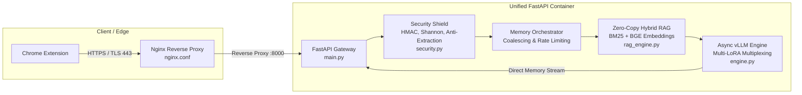

# 🏛️ Ssense Virtual SLM Server (Zero-Hop Architecture)

> **Enterprise-grade, high-throughput Small Language Model (SLM) Server engineered for Digital Personal Data Protection (DPDP) Act 2023 compliance.**

Built on a **Zero-Hop In-Memory Architecture**, this server runs vLLM in-process (no network hop to a separate inference container), dynamically enforces strict VRAM/RAM caps per hardware profile, and scales to 10,000+ concurrent connections via FP8 KV cache compression (where supported), prefix caching, and continuous batching. The extension talks to this server directly — there is no separate local daemon in this version.

---

## 🏗️ System Architecture: The "Zero-Hop" Paradigm



### Key Components

1. **API Gateway (`main.py`)**: Handles Server-Sent Events (SSE) streaming, payload validation, and request routing with native asynchronous concurrency.
2. **Security Shield (`security.py`)**:
   - **HMAC-SHA256 Challenge-Response**: Validates requests via Web Crypto signatures (`X-Ssense-Signature`, `X-Ssense-Timestamp`, `X-Ssense-Nonce`) with a 30s replay window.
   - **Shannon Entropy Filter**: Drops Base64 and obfuscated injection payloads.
   - **ChatML Delimiter Guard**: Filters `<|im_start|>` and `<|im_end|>` sequences to prevent role-hijacking attacks.
   - **Anti-Distillation Shield**: Throttles model extraction probing attempts.
   - **Schema Auto-Repair & Hallucination Gates**: Automatically repairs structural discrepancies against `dpdp_schema.json` and penalizes hallucinated trust scores.
3. **Zero-Copy Hybrid RAG (`rag_engine.py`)**:
   - Memory-maps precomputed `.safetensors` embeddings directly into RAM.
   - Executes dense semantic search (BGE-Small) and sparse lexical search (BM25Okapi) with Reciprocal Rank Fusion (RRF).
4. **vLLM Inference Engine (`engine.py`)**:
   - Direct in-process integration with vLLM PagedAttention.
   - Multi-LoRA multiplexing (`audit_lora` for forensic reports and `chatbot_lora` for interactive guidance).
5. **Edge Nginx Proxy (`nginx/nginx.conf`)**:
   - Terminates TLS with SSL certificates.
   - Disables proxy buffering (`proxy_buffering off`) for immediate token-level Server-Sent Events delivery.

---

## 📂 Directory Layout

```text
apps/slm-server/
├── Dockerfile                  # CUDA 13 / vLLM base container
├── docker-compose.yml          # Multi-container orchestration (server + nginx)
├── main.py                     # FastAPI application endpoints
├── engine.py                   # vLLM async inference driver
├── security.py                 # Cryptographic verification & schema auto-repair
├── rag_engine.py               # In-memory hybrid RAG subsystem
├── memory_orchestrator.py      # Request coalescing and cache manager
├── requirements.txt            # Production Python dependencies
├── schemas/                    # Local schema fallbacks (dpdp_schema.json, dpdp_act_tree.json)
├── nginx/
│   ├── nginx.conf              # SSL reverse proxy configuration
│   └── certs/                  # SSL certificate store (ssense.crt, ssense.key)
├── scripts/
│   └── run.sh                  # One-click startup and credential generation script
└── tests/
    └── test_server_security.py # Unit tests for HMAC, entropy, and schema repair
```

---

## 🚀 Running the SLM Server

### Option A: Local Standalone Development (CPU / Fast Test)

For testing API endpoints, schema validation, and security layers on local machines without Docker or large GPUs:

1. Create and activate a Python virtual environment:
   ```bash
   python -m venv .venv
   # Windows:
   .venv\Scripts\activate
   # Linux/macOS:
   source .venv/bin/activate
   ```

2. Install dependencies:
   ```bash
   pip install -r apps/slm-server/requirements.txt
   ```

3. Run the server via Uvicorn:
   ```bash
   uvicorn apps.slm-server.main:app --host 0.0.0.0 --port 8000 --reload
   ```

### Option B: Docker Compose with NVIDIA GPU (Production)

1. Ensure the NVIDIA Container Toolkit is installed on the host.
2. From `apps/slm-server/`:
   ```bash
   # Make startup script executable (Linux):
   chmod +x scripts/run.sh
   ./scripts/run.sh
   ```
   Or launch directly via Docker Compose:
   ```bash
   docker compose up --build -d
   ```

3. Check health and telemetry:
   ```bash
   curl http://localhost:8000/health
   # Or through Nginx SSL:
   curl -k https://localhost/health
   ```

---

## 🧪 Testing the Security Suite

Run the automated test suite verifying HMAC authentication, Shannon entropy checks, schema validation, and hallucination gates:

```bash
python -m unittest apps/slm-server/tests/test_server_security.py
```

Expected output:
```text
Ran 8 tests in 0.007s
OK (skipped=4)
```

---

## 📡 API Reference

All protected endpoints require the following headers:
- `X-Ssense-API-Key`: Pre-shared API key
- `X-Ssense-Signature`: HMAC-SHA256 signature of `<timestamp>.<nonce>.<body-json>`
- `X-Ssense-Timestamp`: Current UTC Unix timestamp in milliseconds
- `X-Ssense-Nonce`: Unique UUID v4 string

### Endpoints

| Endpoint | Method | Description |
| :--- | :--- | :--- |
| `/health` | `GET` | Telemetry, memory stats, and service status |
| `/v1/audit` | `POST` | Deterministic JSON-schema constrained DPDP audit report |
| `/v1/chat/stream` | `POST` | Server-Sent Events (SSE) RAG-augmented legal chat stream |
