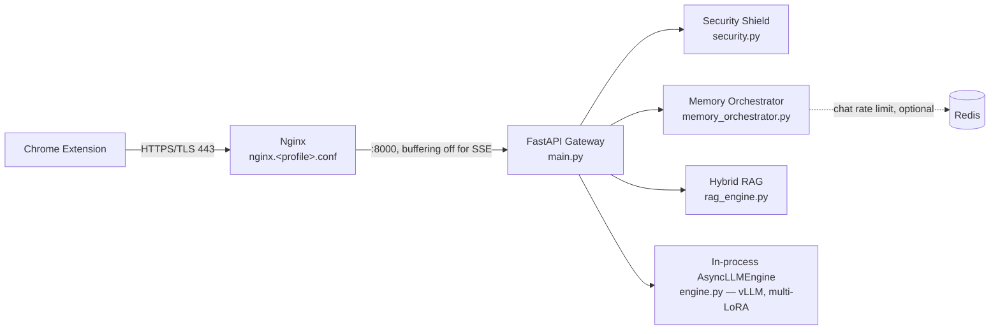

# Ssense Virtual SLM Server: Edge-Optimized Architecture

> **A high-concurrency, low-latency, and heavily hardened inference gateway
> engineered specifically for Digital Personal Data Protection (DPDP) Act
> 2023 enforcement.**
>
> **Current deployment target: 32GB, self-capped in software** regardless
> of the actual GPU's size — see `engine.py::TARGET_TOTAL_MEMORY_GB` and the
> per-profile `_build_gpu_args` / `_build_jetson_args` / `_build_cpu_args`
> methods for the live numbers. This document was previously written
> against an earlier 4-container design (separate `vllm-engine`,
> `slm-gateway`, `redis-queue`, `qdrant-db`) that has since been replaced by
> the single unified container described below — this revision matches the
> actual `apps/slm-server/` code.

This document details the exact features, scaling optimizations, and
security layers implemented in the `apps/slm-server/` stack. The
architecture targets **10,000+ concurrent user *connections*** (async,
held open via SSE; only a bounded batch holds live KV cache at once — see
"Circuit breaker" below) while staying inside the VRAM/RAM ceiling above.

---

## 1. Core engine: one process, multi-LoRA vLLM (`engine.py`)

To serve both the **Forensic Auditor** (JSON generation) and the
**Conversational Chatbot** (natural-language generation) from one process,
without either starving the other of memory:

* **Single base model, two LoRA adapters.** One `Qwen2.5-7B-Instruct`
  (bfloat16) base model is loaded once; `audit_lora` and `chatbot_lora`
  adapters are hot-swapped per request via vLLM's native multi-LoRA
  support (`enable_lora=True, max_loras=2`) — no second model load, no
  extra base-weight VRAM.
* **Per-profile memory budgeting**, computed at boot from the real
  detected hardware, not a hardcoded flag:
  * `gpu` — reads the card's real VRAM via `torch.cuda`, derives the
    `gpu_memory_utilization` fraction needed to stay under the 32GB target
    (or 0.90 on cards smaller than that), and detects real FP8 tensor-core
    support (Hopper/Ada/Blackwell) before enabling FP8 KV cache — Ampere
    cards fall back to `auto` dtype instead of erroring at boot.
  * `jetson` — treats VRAM and system RAM as one unified pool (Jetson's
    actual architecture) and caps usage at the *lower* of 32GB or 60% of
    that pool, deliberately more conservative than `gpu` even when the
    reported figure looks similar.
  * `cpu` — no `gpu_memory_utilization` concept exists on vLLM's CPU
    backend; budgets `VLLM_CPU_KVCACHE_SPACE` explicitly (32GB target minus
    ~15GB estimated bf16 weights) instead.
* **Chunked prefill + prefix caching** (`enable_chunked_prefill`,
  `enable_prefix_caching`) on every profile — repeated statutory/audit
  prefixes are served from cache instead of re-computed per request.
* **FSM/guided-decoding schema cache** (`get_cached_guided_decoding`):
  compiles the DPDP JSON schema into a `GuidedDecodingParams` FSM once and
  reuses it, instead of re-compiling per audit call.

`max_num_seqs` — the actual measured concurrency ceiling, i.e. how many
sequences vLLM runs **on the GPU/CPU at once** — is set per-profile:
**256** (gpu), **16** (jetson), **8** (cpu). This is deliberately far lower
than "10,000 concurrent users"; see §2 for why that's fine.

---

## 2. Server deployment: one container per profile + Nginx + Redis

The SLM server is a **single FastAPI container per hardware profile**
(`slm-server-gpu` / `-jetson` / `-cpu`, mutually exclusive via Docker
Compose `profiles:`), fronted by an Nginx reverse proxy, with one shared
Redis instance for the distributed chat rate limiter:

There is no separate vector-database container: `rag_engine.py`
memory-maps precomputed `.safetensors` embeddings directly into the
process's own RAM and runs BM25 (lexical) + BGE dense search with
reciprocal rank fusion, in-process, on CPU threads via a `ThreadPoolExecutor`
— zero extra services, zero network hop for retrieval.

### Scale & concurrency: async I/O + a queue-depth circuit breaker, not a task queue

* **No Redis job queue.** Requests are handled directly by FastAPI's async
  event loop; `SSENSE_MAX_QUEUE_DEPTH` (default 5000,
  `memory_orchestrator.py::check_circuit_breaker`) is a simple in-process
  counter of requests currently in flight (audit + chat combined). Once it
  hits the cap, new requests get an immediate `503` instead of queueing
  indefinitely — this is the actual mechanism behind "10,000 concurrent
  users": thousands of held-open async SSE connections, most of them
  waiting on I/O rather than occupying a GPU slot, bounded by this counter
  rather than by `max_num_seqs`.
* **Server-Sent Events (SSE) streaming** on `/v1/chat/stream`, with Nginx's
  `proxy_buffering off` specifically on that route (and on `/v1/audit`) so
  tokens reach the client as they're generated instead of being held until
  the upstream response closes.
* **SHA-256 request coalescing.** `memory_orchestrator.acquire_execution_lease`
  hashes `(response_mode, domain, prompt)` for chat requests; if an
  identical request is already in flight, the caller subscribes to the
  same `StreamBroadcaster` instead of triggering a second generation —
  cuts redundant GPU/CPU compute when many users ask the same question
  about the same domain at once. (Audit results are cached far more
  aggressively — see §3 — so audits rarely reach inference at all.)

---

## 3. RAG & audit caching

### Chatbot track: in-process hybrid RAG (`rag_engine.py`)

* Dense embeddings (`bge-small-en-v1.5` via `sentence-transformers`) plus
  BM25 lexical search over the DPDP statute corpus, fused via reciprocal
  rank fusion, with an optional cross-encoder reranker for confidence
  filtering.
* Embeddings are precomputed offline and loaded via
  `safetensors.numpy.load_file` — memory-mapped, not re-embedded at
  request time.
* Runs on a `ThreadPoolExecutor` off the main event loop so retrieval
  never blocks other requests' I/O.
* An `LRUEmbeddingCache` avoids re-embedding repeated queries.

### Audit track: three-tier cache, inference only on genuine miss

`audit_store.py` + `memory_orchestrator.py` implement, in priority order:

1. **Hot in-memory layer** (`LRUTTLCache`, sub-millisecond) — most recent
   512 domains, 5-minute TTL.
2. **SQLite persistent cache** (`aiosqlite`, WAL mode) — 90-day TTL per
   domain.
3. **Policy-hash shortcut** — if the fetched policy's SHA-256 hash matches
   what's stored, the cached result is served regardless of age (the
   policy hasn't changed, so re-running inference would produce the same
   report).

Only a genuine miss on all three reaches `engine.py` for an actual LLM
call. Raw policy text is **never persisted** — it's fetched, sanitized,
used for one inference call, and discarded; only the validated JSON
report and a precomputed natural-language `chat_context` summary are
stored.

The chatbot is gated on this cache: `/v1/chat/stream` reads
`chat_context` directly (no JSON re-parsing on the hot path) and refuses
to answer for a domain with no completed audit, so every chat answer is
grounded in that domain's actual audit findings plus retrieved statute
text — not a generic, ungrounded response.

---

## 4. Cyber defense & system protection (`security.py`)

A sovereign legal-compliance model is a high-value target for adversarial
exploitation. `security.py` implements:

* **Fail-closed secrets in production.** `SSENSE_ENV=production` refuses
  to boot at all if `SSENSE_API_KEYS` / `SSENSE_HMAC_SECRET` are unset or
  match a small hardcoded list of known-leaked placeholder values. In
  development mode only, ephemeral keys are generated and logged instead.
* **HMAC-SHA256 request signing + replay protection.** Requests carry
  `X-Ssense-Signature` (HMAC over `METHOD:path:timestamp:nonce`),
  `X-Ssense-Timestamp` (rejected outside a 30s window), and
  `X-Ssense-Nonce` (checked against a shared replay cache) — verified
  before the API-key-only check even runs.
* **Trusted-proxy-aware client IP resolution.** `X-Forwarded-For` is only
  honored when the direct TCP peer is the Nginx sidecar or localhost;
  otherwise a client could spoof it to defeat every IP-keyed rate limit.
* **Prompt-injection / extraction heuristics.** Regex screening for
  jailbreak phrasing, ChatML delimiter hijacking (`<|im_start|>` etc.), and
  distillation probes (requests for chain-of-thought, raw logits, the
  system prompt itself) — applied to both audit and chat inputs.
* **Shannon-entropy obfuscation guard** on chat prompts only (legal PDF
  text legitimately contains UUIDs/hashes, so this check is skipped for
  audits) — flags Base64/hex-obfuscated payloads that regex alone would
  miss.
* **Schema auto-repair + hallucination gates.** `validate_and_repair_report`
  clamps out-of-range scores, maps drifted `violation_type`/`network_action`
  values back onto the valid enum, and forces the trust score down when
  the model reports violations alongside an implausibly high score, before
  final JSON-schema validation.
* **503 circuit breaker.** Covered in §2 — a queue-depth cap, not a
  Redis-backed priority queue.
* **Distributed, durable chat rate limiting when available.** If
  `SSENSE_REDIS_URL` is reachable, a Lua-scripted atomic sliding-window
  limiter in Redis is used (shared across restarts and — in a future
  multi-replica setup — across replicas); otherwise the server
  automatically falls back to a correct-but-per-process in-memory
  limiter. Chat is rate-limited (60 req/min per API key + IP); audits are
  intentionally not, since the cache above absorbs their cost.
