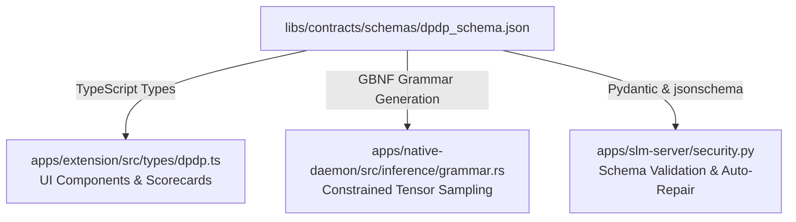

# 📜 Ssense Statutory Contracts & JSON Schemas

> **Single Source of Truth for DPDP Act 2023 Compliance Contracts & Cross-Language Data Schemas.**

The `libs/contracts` package establishes strict, mathematically verifiable contracts between the Chrome Extension frontend, the bare-metal Rust Native Daemon, the FastAPI Virtual SLM Server, and the fine-tuned Small Language Models.

---

## 🏛️ Schema Assets

```text
libs/contracts/
├── schemas/
│   ├── dpdp_schema.json     # Strict JSON Schema for forensic policy audit reports
│   └── dpdp_act_tree.json   # Hierarchical statutory structure of DPDP Act 2023
└── README.md                # Package documentation
```

---

## 📄 Schema Specifications

### 1. Forensic Audit Schema (`schemas/dpdp_schema.json`)
Specifies the exact structure required for an automated policy audit output. LLMs are constrained via GBNF grammar (local engine) or validated and repaired via Python gates (cloud engine) against this schema.

#### Critical Fields:
| Field | Type | Description |
| :--- | :--- | :--- |
| `dpdp_trust_score` | `integer (0-100)` | Calibrated composite compliance rating. 100 = fully compliant, 0 = severe non-compliance. |
| `subtlety_score` | `integer (0-100)` | Rating indicating obfuscation and dark-pattern legalese used to conceal data collection. |
| `summary` | `string` | Executive plain-English summary of policy strengths and compliance risks. |
| `step_1_active_claim_analysis` | `string` | Forensic legal reasoning evaluating data fiduciary claims against statutory duties. |
| `violations` | `array[object]` | Specific instances of statutory non-compliance. |
| `network_action` | `string` | Recommended browser firewall action: `BLOCK`, `WARN`, or `ALLOW`. |
| `data_fiduciary_obligations` | `object` | Detailed section-by-section breakdown of obligations under Sections 4–9. |

#### Violation Object Definition:
```json
{
  "section": "Section 6(1)",
  "violation_type": "bundled_consent",
  "severity": "HIGH",
  "evidence_quote": "By using our service you agree to marketing from our affiliates...",
  "explanation": "Consent for core service cannot be bundled with third-party marketing consent."
}
```

---

### 2. Statutory Knowledge Graph (`schemas/dpdp_act_tree.json`)
The codified tree of the Digital Personal Data Protection (DPDP) Act 2023:
- **Chapters**: Preliminary, Obligations of Data Fiduciary, Rights and Duties of Data Principal, Special Provisions, Data Protection Board of India, Powers and Functions, Penalties, Miscellaneous.
- **Sections**: Detailed legal texts, statutory thresholds, and maximum penalty tiers (up to ₹250 Crore for Section 8(5) failure to protect personal data).
- **Use Cases**: Used by the Hybrid RAG engine (`rag_engine.py` / `rag.rs`) to retrieve exact statutory sections during user chat inquiries and policy evaluations.

---

## 🔄 Multi-Language Synchronization



1. **TypeScript (`apps/extension`)**: Type definitions in `src/types/` match schema keys for type-safe rendering in React components.
2. **Rust (`apps/native-daemon`)**: `grammar.rs` converts `dpdp_schema.json` into a formal GPT-BNF grammar passed to `llama_sample_grammar`, guaranteeing the model produces syntactically valid JSON.
3. **Python (`apps/slm-server`)**: `security.py` runs `validate_and_repair_report()` to validate incoming LLM outputs, repair missing optional fields, map legacy violation aliases, and enforce the hallucination penalty gate.
